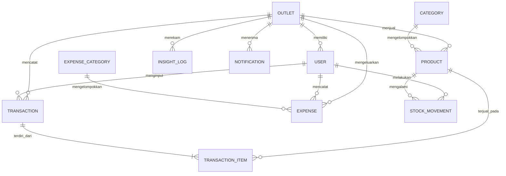
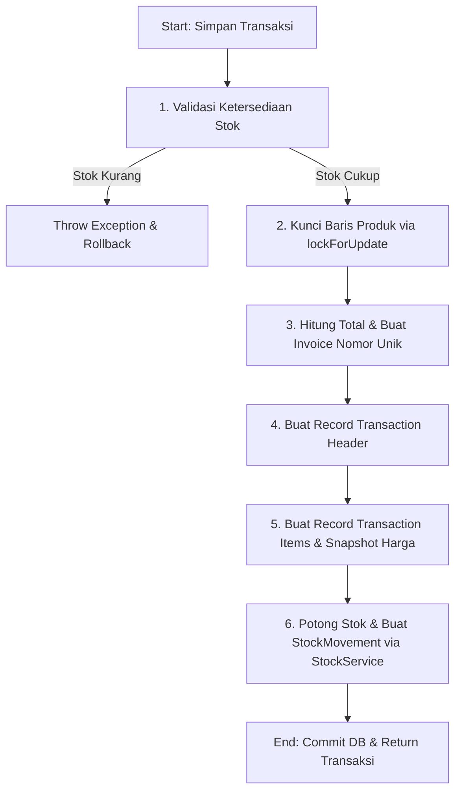

# 🏪 Panduan Arsitektur & Logika Backend Umora

Dokumen ini menjelaskan seluruh arsitektur backend, struktur database, skema ERD, model Eloquent, controller, hingga logika bisnis inti (*core business logic*) pada Service Layer platform Umora.

---

## 🏗️ 1. Gambaran Umum Arsitektur (Multi-Tenant & Layered)

Platform Umora dibangun dengan pendekatan arsitektur berlapis (*layered architecture*) yang memisahkan tanggung jawab data, logika bisnis, dan presentasi:

```
┌─────────────────────────────────────────────────────────────┐
│                     PRESENTATION LAYER                      │
│                                                             │
│   Halaman Web (Blade Templates)     Mobile / REST Client    │
│   (Web Controllers)                 (Api/V1 Controllers)    │
└─────────────┬───────────────────────────────┬───────────────┘
              │                               │
              ▼                               ▼
┌─────────────────────────────────────────────────────────────┐
│                     MIDDLEWARE LAYER                        │
│                                                             │
│         Otentikasi (Session & Sanctum Token Bearer)         │
│         Otorisasi Peran / RBAC (role:owner,admin,kasir)     │
└─────────────┬───────────────────────────────┬───────────────┘
              │                               │
              └───────────────┬───────────────┘
                              ▼
┌─────────────────────────────────────────────────────────────┐
│                       SERVICE LAYER                         │
│                                                             │
│    TransactionService   StockService   InsightService      │
│    ReportService        ChatbotService                      │
│                                                             │
│   ← Seluruh core business logic ada di sini (Reusable) →    │
└─────────────────────────────┬───────────────────────────────┘
                              ▼
┌─────────────────────────────────────────────────────────────┐
│                        DATA LAYER                           │
│                                                             │
│    Eloquent Models (Outlet, User, Product, Transaction,...) │
│    Multi-Tenancy Scopes (byOutlet, active, dll.)            │
└─────────────────────────────┬───────────────────────────────┘
                              ▼
                 ┌──────────────────────────┐
                 │      MySQL Database      │
                 └──────────────────────────┘
```

---

## 🗄️ 2. Struktur Database & Skema ERD

Database dirancang dengan prinsip **Multi-Tenancy** berbasis kolom `outlet_id`. Setiap data penjualan, produk, pengeluaran, dan log terisolasi per-outlet untuk keamanan data.

### Diagram Hubungan Antar Tabel (ERD)



### Penjelasan Tabel Utama
1. **`outlets`**: Entitas bisnis UMKM utama (nama, alamat, nomor telepon).
2. **`users`**: Akun pengguna yang terikat pada satu `outlet_id`. Memiliki kolom `role` (`owner`, `admin`, `kasir`) dan `is_active` (status akun).
3. **`products`**: Daftar produk ritel yang dijual. Menyimpan data penting: `purchase_price` (HPP), `selling_price` (Harga Jual), `stock_qty` (Stok Fisik Saat Ini), dan `stock_minimum` (Ambang Batas Peringatan Stok Tipis).
4. **`transactions`**: Header penjualan. Menyimpan metadata pembayaran: total belanja, diskon nominal, jumlah dibayar, kembalian, dan metode bayar (`cash`, `transfer`, `qris`).
5. **`transaction_items`**: Detail item per transaksi. **Penting:** Tabel ini menduplikasi (*snapshot*) kolom `unit_price` dan `purchase_price` dari tabel produk saat checkout terjadi. Ini krusial agar nilai laporan keuangan historis tetap akurat meskipun di masa depan produk mengalami perubahan harga.
6. **`stock_movements`**: Log audit trail pergerakan inventaris. Setiap perubahan stok dicatat dengan `type` (`in`, `out`, `adjustment`) beserta jumlah dan catatan (*note*).
7. **`expenses`**: Pengeluaran operasional outlet (gaji, sewa, listrik) yang dilengkapi foto nota.

---

## 📦 3. Data Layer: Eloquent Models & Scopes

Setiap model Eloquent di bawah `app/Models/` dilengkapi dengan **Global/Local Scopes** untuk mempermudah isolasi multi-tenant dan filter data.

### Contoh Implementasi Scope Isolasi (`byOutlet`)
Hampir seluruh query menggunakan scope ini untuk memastikan data outlet satu tidak bocor ke outlet lainnya:
```php
public function scopeByOutlet($query, int $outletId)
{
    return $query->where('outlet_id', $outletId);
}
```

### Contoh Implementasi Scope Rentang Waktu (`inPeriod`)
Digunakan pada Laporan dan Insight untuk menyaring data berdasarkan rentang tanggal:
```php
public function scopeInPeriod($query, $startDate, $endDate)
{
    return $query->whereBetween('created_at', [$startDate, $endDate]);
}
```

---

## ⚙️ 4. Service Layer (Core Business Logic)

Logika bisnis **tidak diletakkan di Controller**, melainkan dipusatkan di dalam **Service** agar reusable (dapat digunakan kembali baik oleh rute Web/Blade maupun REST API).

### A. `TransactionService` (Penjualan POS Atomic)
Merupakan logika paling krusial karena mengamankan transaksi checkout. Proses diimplementasikan di dalam `DB::transaction()` untuk memastikan sifat **ACID (Atomic, Consistent, Isolated, Durable)**. Jika salah satu produk gagal tervalidasi atau database mengalami gangguan di tengah jalan, seluruh proses dibatalkan (*rolled back*).

**Alur Kerja Utama:**


### B. `StockService` (Single Entry Point Inventaris)
Mengelola perubahan stok produk secara aman. Metode `recordMovement()` bertanggung jawab untuk:
1. Menghitung mutasi stok baru pada produk.
2. Melakukan operasi update pada field `stock_qty` di tabel `products`.
3. Menulis entri log audit ke tabel `stock_movements`.

### C. `ReportService` (Kalkulasi Finansial & Laba Rugi)
Menangani kalkulasi keuangan bulanan atau periodik. Contoh kalkulasi **Profit & Loss (Laba Rugi)**:
1. **Total Income (Pendapatan Kotor):** Jumlah `total_amount` dari seluruh transaksi di bulan berjalan.
2. **COGS (Harga Pokok Penjualan):** Jumlah total dari `purchase_price * qty` pada `transaction_items`.
3. **Gross Profit (Laba Kotor):** `Total Income - COGS`.
4. **Expenses (Pengeluaran Operasional):** Jumlah pengeluaran pada tabel `expenses` untuk bulan tersebut.
5. **Net Profit (Laba Bersih):** `Gross Profit - Expenses`.

### D. `InsightService` (Engine Analitik Cerdas)
Engine yang membaca tren data secara mendalam untuk menyajikan rekomendasi:
- **Financial Insight:** Menganalisis *Net Profit Margin %* dan mengkalkulasikan rasio pengeluaran dibanding omzet.
- **Declining Products:** Membandingkan kuantitas penjualan produk antara bulan ini dengan bulan lalu untuk menemukan produk yang penjualannya merosot tajam.
- **Low Stock Insight:** Mencari produk kritis yang stoknya kosong atau mendekati ambang batas minimum.

### E. `ChatbotService` (Natural Language Processing Intuitif)
Chatbot bertindak sebagai asisten pintar personal Owner. Ia memproses input pertanyaan bahasa Indonesia menggunakan pencocokan pola kata kunci (*keyword matching*):

```php
protected array $intentMap = [
    'penurunan'   => 'handleDecliningProducts',
    'stok rendah' => 'handleLowStock',
    'pengeluaran' => 'handleMonthlyExpenses',
    'terlaris'    => 'handleTopSellingProducts',
    'pendapatan'  => 'handleTotalRevenue',
    'laba'        => 'handleProfitLoss',
];
```

**Alur Pemrosesan Chatbot:**
1. Pertanyaan dinormalisasi menjadi huruf kecil.
2. Mencari kecocokan kata kunci pada peta *Intent*.
3. Jika cocok, memanggil fungsi *handler* yang bersangkutan.
4. Fungsi handler memanggil `InsightService` atau melakukan query langsung ke database, menyusun kalimat respons bahasa Indonesia yang natural (`answer`), dan mengembalikan data mentah (`data`) untuk kebutuhan visualisasi di frontend.

---

## 🛡️ 5. Middleware & Access Control Layer (RBAC)

Melindungi hak akses rute web dan API menggunakan `RoleMiddleware`.

### Skema Hak Akses Modul:
| Modul | Endpoint / Rute | Owner | Admin | Kasir | Deskripsi |
|---|---|:---:|:---:|:---:|---|
| **Dashboard** | `/dashboard`, `/api/v1/me` | ✅ | ✅ | ✅ | Halaman ringkasan profil & bisnis umum. |
| **Kasir (POS)** | `/transactions/*`, `/api/v1/transactions/*` | ✅ | ✅ | ✅ | Pembuatan penjualan & cetak struk harian. |
| **Katalog** | `/products/*`, `/api/v1/products/*` | ✅ | ✅ | ❌ | Tambah/edit harga & detail barang jualan. |
| **Stok Audit** | `/stock/*`, `/api/v1/stock-movements/*` | ✅ | ✅ | ❌ | Penyesuaian (*adjust*) stok fisik manual. |
| **Pengeluaran** | `/expenses/*`, `/api/v1/expenses/*` | ✅ | ✅ | ❌ | Log biaya operasional toko. |
| **Laporan** | `/reports/sales`, `/reports/expenses` | ✅ | ✅ | ❌ | Laporan rekonsiliasi harian/bulanan. |
| **Laba Rugi** | `/reports/profit-loss`, `reports/profit-loss` | ✅ | ❌ | ❌ | Laporan keuangan laba rugi terdalam. |
| **Analitik** | `/insights/*`, `/api/v1/insights/*` | ✅ | ❌ | ❌ | Grafik kecenderungan & data analitik. |
| **AI Chatbot** | `/chatbot/*`, `/api/v1/chatbot/*` | ✅ | ❌ | ❌ | Tanya-jawab performa bisnis secara privat. |
